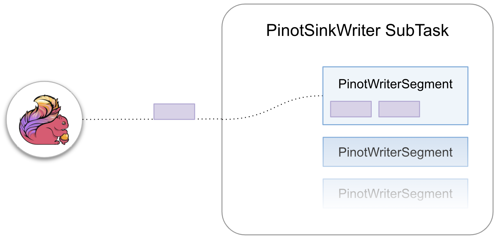
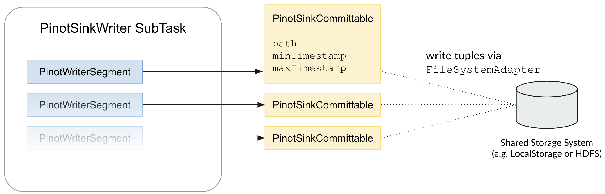
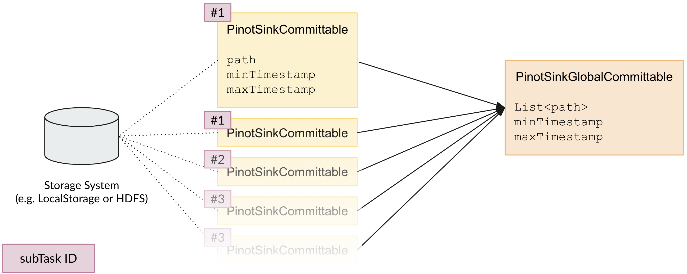

# Flink Pinot Connector

This connector provides a sink to [Apache Pinot](http://pinot.apache.org/)™.  
To use this connector, add the following dependency to your project:

    <dependency>
      <groupId>org.apache.bahir</groupId>
      <artifactId>flink-connector-pinot_2.11</artifactId>
      <version>1.1-SNAPSHOT</version>
    </dependency>

*Version Compatibility*: This module is compatible with Pinot 0.6.0.

Note that the streaming connectors are not part of the binary distribution of Flink. You need to link them into your job jar for cluster execution.
See how to link with them for cluster execution [here](https://ci.apache.org/projects/flink/flink-docs-release-1.2/dev/linking.html).

The sink class is called `PinotSink`.

## Architecture
The Pinot sink stores elements from upstream Flink tasks in an Apache Pinot table.
We support two execution modes
* `RuntimeExecutionMode.BATCH`
* `RuntimeExecutionMode.STREAMING` which requires checkpointing to be enabled.

### PinotSinkWriter
Whenever the sink receives elements from upstream tasks, they are received by an instance of the PinotSinkWriter.
The `PinotSinkWriter` holds a list of `PinotWriterSegment`s where each `PinotWriterSegment` is capable of storing `maxRowsPerSegment` elements.
Whenever the maximum number of elements to hold is not yet reached the `PinotWriterSegment` is considered to be active.
Once the maximum number of elements to hold was reached, an active `PinotWriterSegment` gets inactivated and a new empty `PinotWriterSegment` is created.



Thus, there is always one active `PinotWriterSegment` that new incoming elements will go to.
Over time, the list of `PinotWriterSegment` per `PinotSinkWriter` increases up to the point where a checkpoint is created.

**Checkpointing**  
On checkpoint creation `PinotSinkWriter.prepareCommit` gets called by the Flink environment.
This triggers the creation of `PinotSinkCommittable`s where each inactive `PinotWriterSegment` creates exactly one `PinotSinkCommittable`.



In order to create a `PinotSinkCommittable`, a file containing a `PinotWriterSegment`'s elements is on the shared filesystem defined via `FileSystemAdapter`.
The file contains a list of elements in JSON format. The serialization is done via `JSONSerializer`.
A `PinotSinkCommittables` then holds the path to the data file on the shared filesystem as well as the minimum and maximum timestamp of all contained elements (extracted via `EventTimeExtractor`).


### PinotSinkGlobalCommitter
In order to be able to follow the guidelines for Pinot segment naming, we need to include the minimum and maximum timestamp of an element in the metadata of a segment and in its name.
The minimum and maximum timestamp of all elements between two checkpoints is determined at a parallelism of 1 in the `PinotSinkGlobalCommitter`.
This procedure allows recovering from failure by deleting previously uploaded segments which prevents having duplicate segments in the Pinot table.



After all `PinotSinkWriter` subtasks emitted their `PinotSinkCommittable`s, they are sent to the `PinotSinkGlobalCommitter` which first combines all collected `PinotSinkCommittable`s into a single `PinotSinkGlobalCommittable`.
Therefore, the minimum and maximum timestamps of all collected `PinotSinkCommittable`s is determined. 
Moreover, the `PinotSinkGlobalCommittable` holds references to all data files from the `PinotSinkCommittable`s.

When finally committing a `PinotSinkGlobalCommittable` the following procedure is executed:
* Read all data files from the shared filesystem (using `FileSystemAdapter`).
* Generate Pinot segment names using `PinotSinkSegmentNameGenerator`.
* Create Pinot segments with minimum and maximum timestamps (stored in `PinotSinkGlobalCommittable`) and previously generated segment assigned.
* Upload Pinot segments to the Pinot controller


## Delivery Guarantees
Resulting from the above described architecture the `PinotSink` provides an at-least-once delivery guarantee.
While the failure recovery mechanism ensures that duplicate segments are prevented, there might be temporary inconsistencies in the Pinot table which can result in downstream tasks receiving an element multiple times.

## Options
| Option                 | Description                                                                      |
| ---------------------- | -------------------------------------------------------------------------------- | 
| `pinotControllerHost`  | Host of the Pinot controller                                                     |
| `pinotControllerPort`  | Port of the Pinot controller                                                     |
| `tableName`            | Target Pinot table's name                                                        |
| `maxRowsPerSegment`    | Maximum number of rows to be stored within a Pinot segment                       |
| `tempDirPrefix`         | Prefix for temp directories used                                                  |
| `jsonSerializer`       | Serializer used to convert elements to JSON                                      |
| `eventTimeExtractor`   | Defines the way event times are extracted from received objects                   |
| `segmentNameGenerator` | Pinot segment name generator                                                     |
| `fsAdapter`            | Filesystem adapter used to save files for sharing files across nodes               |
| `numCommitThreads`     | Number of threads used in the `PinotSinkGlobalCommitter` for committing segments |

## Usage
```java
StreamExecutionEnvironment env = ...
// Checkpointing needs to be enabled when executing in STREAMING mode
        env.enableCheckpointing(long interval);

        DataStream<PinotRow> dataStream = ...
        PinotSink pinotSink = new PinotSink.Builder<PinotRow>(String pinotControllerHost, String pinotControllerPort, String tableName)

        // Serializes a PinotRow to JSON format
        .withJsonSerializer(JsonSerializer<PinotRow> jsonSerializer)

        // Extracts the timestamp from a PinotRow
        .withEventTimeExtractor(EventTimeExtractor<IN> eventTimeExtractor)

        // Defines the segment name generation via the predefined SimpleSegmentNameGenerator
        // Exemplary segment name: tableName_minTimestamp_maxTimestamp_segmentNamePostfix_0
        .withSimpleSegmentNameGenerator(String tableName, String segmentNamePostfix)

        // Use a custom segment name generator if the SimpleSegmentNameGenerator does not work for your use case
        .withSegmentNameGenerator(SegmentNameGenerator segmentNameGenerator)

        // Use a custom filesystem adapter. 
        // CAUTION: Make sure all nodes your Flink app runs on can access the shared filesystem via the provided FileSystemAdapter
        .withFileSystemAdapter(FileSystemAdapter fsAdapter)

        // Defines the size of the Pinot segments
        .withMaxRowsPerSegment(int maxRowsPerSegment)

        // Prefix within the local filesystem's temp directory used for storing intermediate files
        .withTempDirectoryPrefix(String tempDirPrefix)
        
        // Number of threads used in the `PinotSinkGlobalCommitter` to commit a batch of segments
        // Optional - Default is 4
        .withNumCommitThreads(int numCommitThreads)

        // Builds the PinotSink
        .build()
        dataStream.addSink(pinotSink);
```
